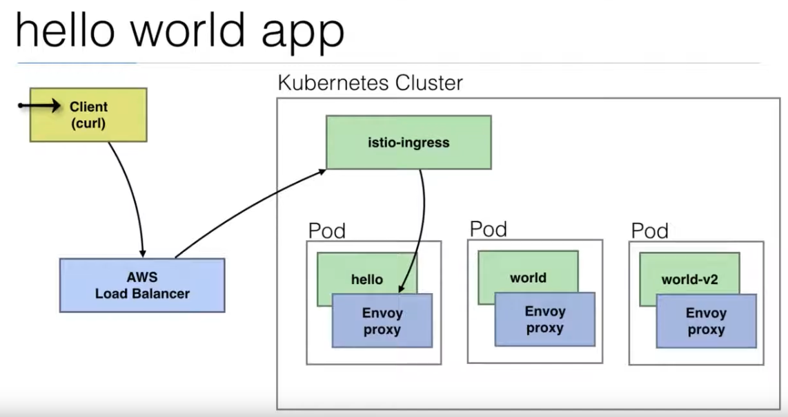

## Istio enabled apps

``sh
kubectl apply -f <(istioctl kube-inject -f deployment.yaml)>
kubectl apply -f deployment.yaml

kubectl apply -f istio-gw.yaml
kubectl get svc
kubectl get svc -n istio-systm
curl <load balancer>/hello

output: hello world !!!
